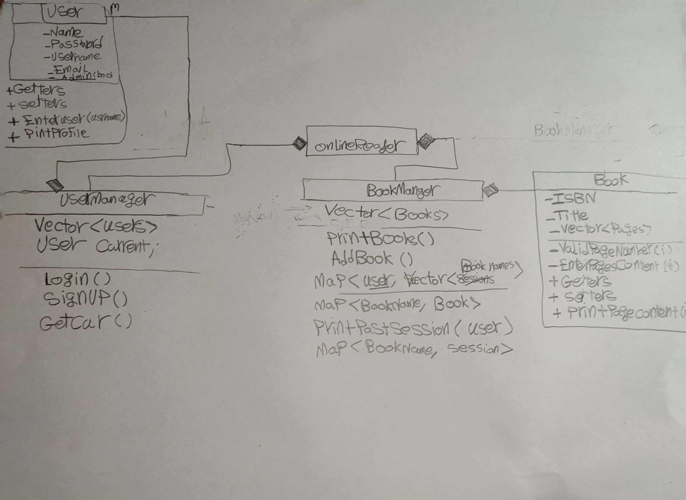

# ToDo:
#### I want to finish this project in a week
* Day #1:
  * Design
    *  UML   Classes `It's Not a one time Task`
      * Design After Simple Features
       
* Day #2 :
* Day #3:
  * design UML Classes **Managers, System**
  * Type OnlineReader Extentions
  * Type UserManager Extensions 
  * Implement Basic UserManager Features
* Day #4:
    * Type extensions of OnlineReaderSystem
    * Determine Operation Base  **_User or Book_**
* Day #5:
  * Implement UserManager
* Day #6:
  * Implement BooksManager
* Day #7:
  * Debug and test the whole Project

# Finished
  * [x] Implement Utilities and menus
  * [x] Structure Header Files
  * [x] Implement Book Class
  * [x] Implement User Class

# Notes
1. Testing
   * Test Your system after each session
   * Agile-->After finishing part see it's solution
2. Keeping changes
   * Always commit with good messages
3. For not getting confused
   * Implement simple features first
   * Think on paper not on pc
   * Think what's purpose of this function
   * keep working small, so that you don't get mad
   * "ولو انكم تتوكلون علي الله حق توكله لرزقكم كما يرزق الطير تغدو خماصا و تروح بطانا"
   * 
